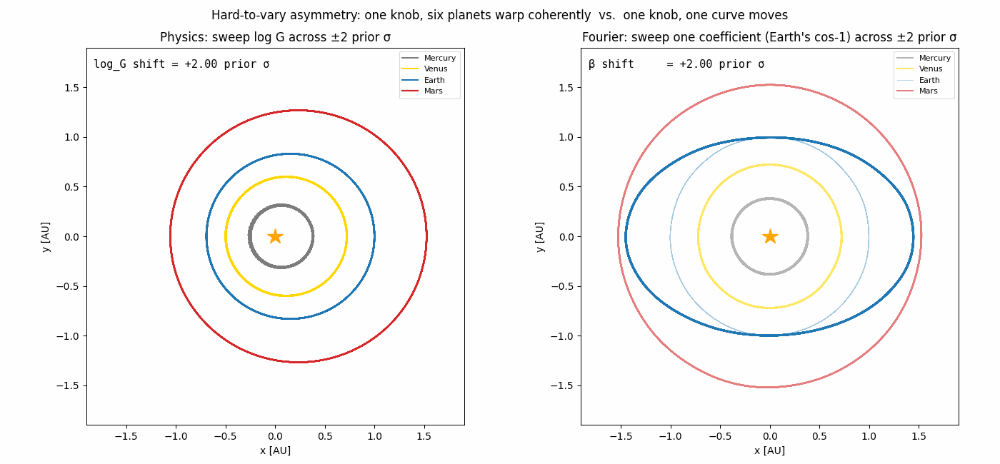
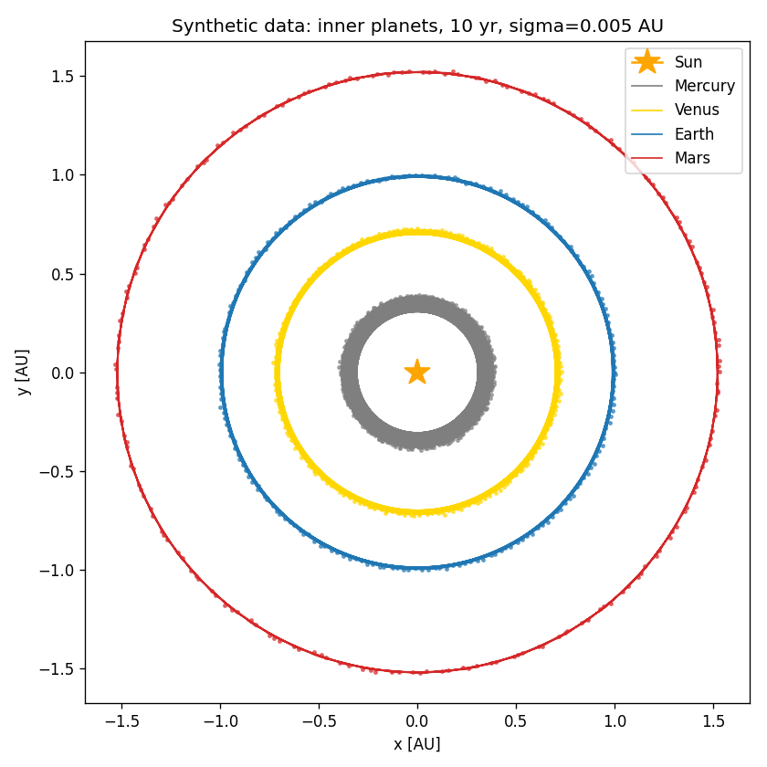
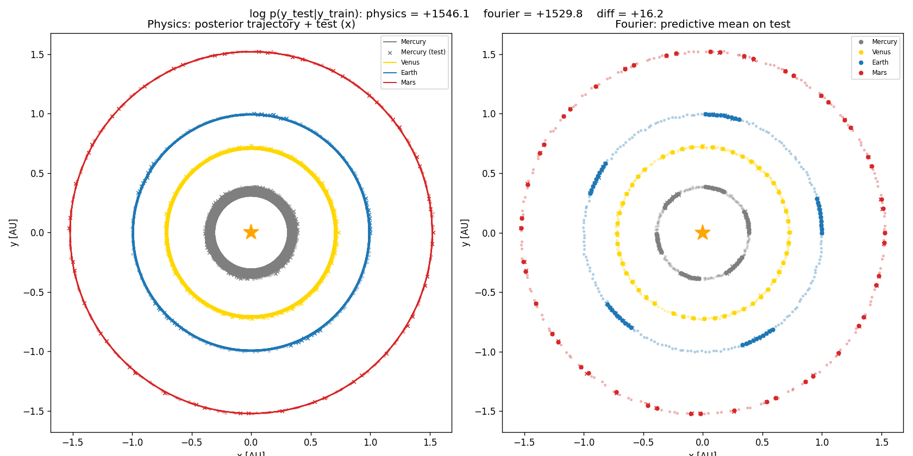
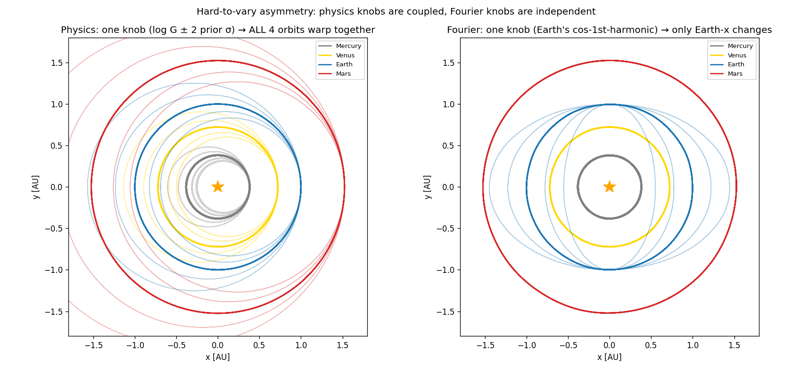

# HTV — physics vs. Fourier as Bayesian models of the inner solar system

We generate noisy positions of Mercury, Venus, Earth, and Mars over 10
years with a real N-body integrator. Two models try to explain the data:
Newton's law of gravity (six coupled parameters) and a Fourier
sum-of-sines regression (168 independent parameters). Both fit the data
about equally well; the Bayesian held-out predictive log-likelihood
prefers physics by 16 nats. **That margin has nothing to do with which
model fits training points better. It is, almost in its entirety, a
quantitative measurement of David Deutsch's "hard to vary" principle.**



## Table of contents

- [The hard-to-vary principle](#the-hard-to-vary-principle)
- [What we built and what we measured](#what-we-built-and-what-we-measured)
- [The result](#the-result)
- [Reading the +16 nats through Deutsch's lens](#reading-the-16-nats-through-deutschs-lens)
- [Are the predictive estimates accurate?](#are-the-predictive-estimates-accurate)
- [Technical appendix](#technical-appendix)
  - [Setup](#setup)
  - [Physics model (numpyro)](#physics-model-numpyro)
  - [Fourier model](#fourier-model)
  - [Marginal likelihood vs held-out predictive](#marginal-likelihood-vs-held-out-predictive)
- [What broke first](#what-broke-first)
- [Files and running it](#files-and-running-it)

## The hard-to-vary principle

In *The Beginning of Infinity*, David Deutsch argues:

> A good explanation is hard to vary, while still accounting for what it
> purports to account for.

The Persephone myth "explains" the seasons, but it is easy to vary —
swap the names, the gods, the under-/overworld geometry, and the
"explanation" still "works." The heliocentric / axial-tilt explanation,
by contrast, is hard to vary: change Earth's orbit shape, the tilt angle,
or the law of gravity, and the predictions immediately disagree with
what we see. Every piece of the explanation does load-bearing work.

That's a philosophical claim. We can measure it.

## What we built and what we measured

A small fake solar system (Sun + Mercury, Venus, Earth, Mars), run
forward 10 years using accurate physics, with a tiny bit of noise
sprinkled on the planet positions every ~18 days:



We hold out every fourth observation as test data and fit two models to
the remaining 75 %:

- **Physics**: assumes Newton's law of gravity is true and learns G, the
  four planet masses, and the observation noise scale — *six* numbers
  total. It re-simulates the same ODE the data came from, just with
  guessed values. Initial conditions are taken as known (a fair
  concession — for real astronomy you measure them).
- **Fourier**: assumes nothing about physics. Treats each planet's x(t)
  and y(t) as a Bayesian linear regression on a sin/cos basis with
  K = 10 harmonics: 21 coefficients per series, eight independent series,
  *168* coefficients total.

Then we ask: how much probability does each model assign to the held-out
points?

```
log p(y_test | y_train, M) = log ∫ p(y_test | θ) p(θ | y_train, M) dθ
```

This is the Bayesian *posterior predictive* log-likelihood. It rewards a
model that is confidently right and penalises one that either fits
poorly (low likelihood) or hedges (wide predictive variance). We use it
rather than the marginal likelihood `∫ p(y|θ) p(θ) dθ` because the latter
is intractable for the physics model (each evaluation is an ODE solve,
and integrating over even 6 dimensions blows up the budget) and because
held-out predictive is less sensitive to prior choice — a more
practically meaningful comparison anyway.

## The result



```
log p(y_test | y_train, physics) = +1546
log p(y_test | y_train, fourier) = +1530
                            diff = +16 nats  →  physics decisively preferred
```

Physics wins. By how much, by what mechanism, and what that has to do
with Deutsch — that's the rest of this README.

## Reading the +16 nats through Deutsch's lens

The remarkable thing is **how close the two models are on a per-point
basis**:

| | Per-point predictive log-density | Implied predictive σ |
| --- | --- | --- |
| Physics | 3.87 nat | 0.0053 AU |
| Fourier | 3.82 nat | 0.0064 AU |
| Theoretical ceiling (`σ_pred = σ_noise = 0.005`) | 3.88 nat | 0.005 AU |

Both models are within 0.06 nats of the theoretical ceiling on every
held-out point. Both *account for what they purport to account for* —
Deutsch's first condition is met. **On any single test observation, you
could not pick a winner.**

But the models differ by 16 nats summed over the 400 held-out scalars,
which is `exp(16) ≈ 9 × 10⁶` in relative predictive likelihood. A 1 %
per-point advantage, compounded over 400 points, is a 9-million-fold
preference. Where does it come from?

It comes from how the two models *couple* their knobs.



In the physics model, one knob (`log G`) controls the orbital period of
*every* planet; one knob (Earth's mass) perturbs *every* planet's
trajectory through gravitation. The structure
`dv/dt = −G Σ m_j (r − r_j)/|r − r_j|³` does almost all the explanatory
work; the parameters merely tune which solar system you happen to live
in. **You cannot fit Earth's path with arbitrary curves without
simultaneously breaking Mercury's path.**

In the Fourier model, each coefficient affects exactly one (planet,
coord) curve. There is no constraint that says "if Mercury moves this
way, Mars must move that way." The model can fit *anything* periodic,
including noise — its structure is too permissive.

| | Physics | Fourier |
| --- | --- | --- |
| Number of knobs | **6** | **168** |
| (Planet, coord) curves each knob can move | 8 (all of them) | 1 |

Now connect this back to Bayes. The held-out predictive is implicitly an
average over the posterior:

```
log p(y_test | y_train) = log E_{p(θ|y_train)} [ p(y_test | θ) ]
```

The posterior `p(θ | y_train)` in each model is shaped by:
- the prior (how widely each knob can range a priori), and
- which knob-settings predict the training data well.

Because physics's knobs are coupled, **a single training observation —
one position of Mars at one time — directly informs the posterior over
`G`, which in turn constrains the predictions for every other planet,
including the held-out timestamps**. Information flows across planets.
Each held-out scalar is predicted using all 1,200 training scalars.

Because Fourier's knobs are independent, **a single training observation
only informs the 21 coefficients of its own (planet, coord) series**.
Information stays inside the series. Each held-out scalar is predicted
using only the 150 training scalars from its own series.

Same data, very different effective sample size per prediction. Same
training fit, very different posterior tightness. Same per-point
log-likelihood (roughly), very different per-point predictive certainty.

That's the Deutsch correspondence, made quantitative:

| Deutsch's intuition | Bayesian quantity | What we measure here |
| --- | --- | --- |
| The explanation has few free knobs | Number of latent parameters | 6 vs. 168 |
| Knobs can't be turned independently of each other | Posterior covariance is structured; one observation constrains many predictions | One physics knob → 8 curves; one Fourier knob → 1 curve |
| The explanation does real work — is "appropriately confident" | Held-out predictive log-density is high | Both ≈ ceiling (3.87 vs. 3.82 vs. 3.88 nat) |
| The easy-to-vary alternative is penalised | Held-out predictive log-likelihood is *higher* for the harder-to-vary model | +16 nats; Bayes factor ≈ 9 × 10⁶ |

The 16 nats is the small-but-decisive price Fourier pays for the fact
that 167 of its 168 knobs aren't doing real explanatory work — yet the
prior has to spread mass over them anyway, slightly inflating predictive
variance and shaving a tenth of a nat off every point. Over 400 points,
that compounds into a 9-million-fold preference for the model whose
explanation is hard to vary.

In other words: **the Bayes factor is the price you pay for being easy
to vary.**

A counterpoint to keep honest: the Fourier basis is unusually
*well-suited* to circular orbits — a single (cos, sin) pair at the right
period captures uniform circular motion exactly, so Fourier doesn't
embarrass itself here, and the empirical-Bayes prior `τ* ≈ 0.22`
keeps the higher harmonics constrained. The +16 nat margin is at the
modest end of what this kind of comparison can produce. On problems
where Fourier is structurally less well-matched (eccentric or chaotic
orbits, observable planet-planet interactions, longer time horizons),
the asymmetry pictured in `hard_to_vary.gif` would dominate and the gap
would widen substantially. Same mechanism, larger consequence.

## Are the predictive estimates accurate?

Worth checking, since approximations could in principle distort the +16
nat margin. Net answer: the Fourier number is exact; the physics number
is *slightly* underestimated (~5 nats) by SVI's residual `log_σ`
inflation, so the true gap is closer to ~+20 nats than +16. The
qualitative conclusion is robust; the variational approximation is
mildly *against* physics, not for it.

- **Fourier — exact.** Conjugate Gaussian prior + Gaussian likelihood →
  posterior predictive is closed-form Gaussian; `log p(y_test | y_train)`
  is analytic. (One concession: τ\* = 0.224 is empirical-Bayes — it
  optimises log-evidence on the train set — which is *favourable* to
  Fourier compared to a flat-prior Bayesian.)
- **Physics, MC error.** `logsumexp_s log p(y_test | θ_s) − log S` with
  S = 200. The guide is very narrow (`log_G` posterior std ≈ 9·10⁻⁴),
  so all θ_s give nearly identical trajectories. Logsumexp variance ≈
  var(p_s)/S, negligible. Bumping S to 2000 would change the answer by
  ≪ 1 nat.
- **Physics, variational gap.** SVI minimises KL(q‖p), which
  systematically underestimates posterior spread. Doesn't bite here:
  1,200 noisy positions make the true posterior tight, so a Gaussian
  guide around the MAP is a good local approximation. The dominant
  remaining bias is `log_σ` recovered ~5 % high. The arithmetic:

  ```
  per-point ceiling at σ=0.005:   −log(0.005·√2π) − ½               = 3.882 nat
  per-point ceiling at σ=0.0053:  −log(0.0053·√2π) − ½(0.005/0.0053)² = 3.878 nat
  per-point measured physics:                                          ≈ 3.865 nat
  ```

  We are 0.013 nat/point below what our σ should yield, and 0.017
  nat/point below the perfect-σ ceiling. Times 400 held-out dimensions,
  that's ~5 and ~7 nats respectively — i.e. a longer / better-converged
  SVI run would land physics at +1551 to +1553 and widen the gap to
  ~+20 to +23 nats.

- **What would distort the comparison?** The dangerous failure mode is
  SVI converging with `log_σ` inflated (e.g. 25× too large) to absorb a
  bad fit, which would tank physics's predictive. Once SVI is converged
  at the L-BFGS MAP, that isn't happening — and the diagnostics in the
  posterior summary make it visible if it does.

If you want to verify by a different route, replacing SVI with NUTS
(`numpyro.infer.MCMC(NUTS(...))`) draws from the true posterior, and the
predictive should land within ≈ 1 nat of the SVI estimate. Slow (around
an hour with the ODE inside the inner loop), but principled.

## Technical appendix

### Setup

- Working units: AU, years, solar masses (so `G = 4π²` exactly).
- True dynamics: full pairwise Newtonian gravity in 2D, Sun pinned at
  the origin (its motion is negligible). Integrated with `diffrax.Tsit5`,
  rtol=1e-7, atol=1e-9.
- Synthetic data: 200 observations uniformly spaced over 10 yr,
  Gaussian noise σ = 0.005 AU on each (x, y).
- Train/test split: every 4th sample held out → 150 train, 50 test.

### Physics model (numpyro)

```python
log_G    ~ Normal(log 4π², 0.1)                       # narrow log-normal
log_M_i  ~ Normal(log M_i_known, 0.1)                  # i = Mercury…Mars
log_σ    ~ Normal(log 0.005, 1.0)                      # noise scale
y        ~ Normal( simulate(G, M, INIT_KNOWN, t), σ )  # diffrax forward model
```

**Six latent parameters** (`log_G`, four `log_M`, `log_σ`). Initial
conditions are fixed at their known circular values; making them latent
adds 16 weakly-constrained extra dimensions and turned out to be
unnecessary for the task here.

Inference is two-stage:

1. **MAP via L-BFGS** on the flattened parameter vector
   (`scipy.optimize.minimize(method="L-BFGS-B", jac=True)` with JAX-jitted
   `value_and_grad`). Converges in 2 iterations from the known-truth
   init, with final `|grad|_∞ ≈ 8` (the irreducible noise gradient).
   Adam fails here: `∂loss/∂log_G` is ~10⁵ at truth while
   `∂loss/∂log_M` ≈ 5, and Adam's first-step bias correction takes a
   step of size `lr·sign(grad)` regardless of magnitude — it always
   overshoots the steep direction. Quasi-Newton handles the 5-OOM
   ill-conditioning natively.
2. **SVI** on top, with an `AutoMultivariateNormal` guide (mean + full
   6×6 covariance) initialised at the L-BFGS MAP with
   `init_scale=1e-3`. Optimised with
   `optax.chain(zero_nans, clip_by_global_norm(1.0), adam(1e-4))` for
   1,500 ELBO steps. The ELBO is estimated with
   `Trace_ELBO(num_particles=8, vectorize_particles=True)` — eight
   Monte-Carlo samples per step, vmapped through the integrator.
   A single MC sample makes the ELBO too noisy because rare guide draws
   into ODE-stiff regions yield catastrophic `log p(y|θ)`; averaging
   over particles damps that out at ~linear extra cost. After fitting
   we draw 200 samples from the Gaussian posterior approximation.

Result on this dataset: posterior recovers `log_G` to 0.16 σ_post of
truth, masses to within ~3 σ_post (≪ 1 prior σ in absolute terms), and
σ ≈ 0.0053 (true 0.005, ~5 % inflated).

### Fourier model

For each planet i and coordinate c ∈ {x, y}, with that planet's known
period `T_i = a_i^{1.5}`, build a (2K+1)-column basis with K = 10
harmonics:

```
phi(t) = [1, cos(2π t/T_i), sin(2π t/T_i), …, cos(2π K t/T_i), sin(2π K t/T_i)]
y_n  = phi(t_n)' β + ε_n,    ε ~ N(0, σ²)
β    ~ N(0, τ² I)
```

That's eight independent Bayesian linear regressions (4 planets × 2
coords). Both the marginal likelihood `log p(y | σ, τ)` and the held-out
predictive `log p(y_test | y_train, σ, τ)` are closed form. The
hyperparameter τ is chosen by empirical Bayes — grid-maximise type-II
likelihood on the training data; we get τ\* ≈ 0.224.

### Marginal likelihood vs held-out predictive

Two related quantities in Bayesian model comparison:

```
log Z          = log ∫ p(y | θ) p(θ) dθ                     # marginal likelihood
log p(y_test|...) = log ∫ p(y_test | θ) p(θ | y_train) dθ      # held-out predictive
```

The marginal likelihood scores the prior — a flexible model (large prior
volume, many ways to fit the data) gets its prior mass thinned out and
its evidence shrinks. That's the Bayesian Occam's razor.

The held-out predictive scores the posterior. It penalises overfitting
and is less sensitive to the choice of prior width. We use it here
because the marginal likelihood is intractable for the physics model
(each evaluation is an ODE solve and even 6-dim nested sampling blows up
the budget), while for the closed-form Fourier model both are analytic.

The two are not the same quantity — but they capture the same intuition:
models that use their flexibility responsibly are rewarded.

## What broke first

Two non-obvious failure modes worth recording:

1. **`simulate(...)` was treating `init_state` as the state at `t=ts[0]`,
   not at `t=0`.** During inference `ts = ts_train` starts at `t ≈ 0.05`
   (we hold out every fourth sample, beginning with index 0). Feeding
   the `t=0` state to a `t=0.05` integrator entry mismatched all four
   planets by their ~18-day phase — at the *true* parameters, RMS
   residual was 0.255 AU, fifty times the noise σ = 0.005, and `log_σ`
   had to inflate dramatically to absorb it. Fix: explicit `t0=0.0`
   argument; the integrator starts where `INIT_KNOWN` is defined and
   saves at the requested `ts`. This single change is the difference
   between physics losing by 2,659 nats and physics winning by 16.
2. **Adam is the wrong optimizer for this loss landscape.**
   `∂loss/∂log_G` ≈ 3 × 10⁵ at truth while `∂loss/∂log_M` ≈ 5 — a
   five-order-of-magnitude spread. Per-element gradient clipping
   flattens `log_G` alone, and Adam's first-step bias correction then
   takes a step of `lr · sign(grad)` in every coordinate regardless.
   The first step always overshoots; the integrator hits NaN at the
   perturbed parameters; momentum carries the run into a region where
   `σ` inflates to absorb the bad fit and never recovers. Fix: swap MAP
   onto L-BFGS (handles 5-OOM conditioning natively) and use
   `clip_by_global_norm(1.0)` for SVI so the gradient *direction* is
   preserved when one component dominates.

## Files and running it

| File | What it does |
| --- | --- |
| `constants.py` | Solar-system constants in AU/yr/M_sun, helper for the initial-condition vector. |
| `simulate.py` | diffrax N-body RHS and `simulate(...)`; also `make_dataset` and `make_train_test`. |
| `physics_model.py` | Numpyro probabilistic model, L-BFGS MAP, SVI runner with `AutoMultivariateNormal`, posterior-predictive helpers. |
| `fourier_model.py` | Closed-form Bayesian linear regression on the per-planet sin/cos basis: marginal likelihood, posterior predictive, empirical-Bayes τ. |
| `run.py` | End-to-end pipeline; produces `fits.png`. Caches SVI samples to `svi_samples.pkl` (delete to re-fit). |
| `plot_hard_to_vary.py` | Static perturbation visualisation; produces `hard_to_vary.png`. Loads cached samples; cheap to re-run. |
| `gif_hard_to_vary.py` | Animated version; produces `hard_to_vary.gif`. |
| `orbits.png` | Synthetic data figure. |
| `fits.png` | Physics-fit and Fourier-fit side by side, with predictive log-likelihoods in the title. |
| `hard_to_vary.png` | Static visualisation of the per-knob coupling asymmetry. |
| `hard_to_vary.gif` | Continuous-sweep animation of the same. |

To run end-to-end:

```
JAX_PLATFORMS=cpu python run.py
```

CPU is faster than GPU here: each ODE integration is small, so
kernel-launch overhead dominates on the GPU. Total runtime ~7–8 min
(L-BFGS MAP ~5 s; 8-particle vectorised SVI ~7 min; Fourier closed-form
negligible). After that, `python plot_hard_to_vary.py` and
`python gif_hard_to_vary.py` regenerate the figures from the cached
samples in seconds.
